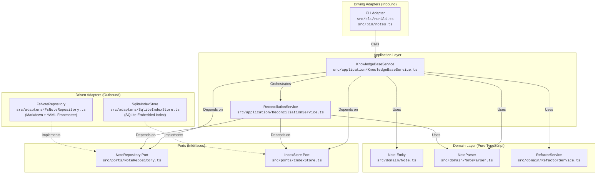

# Personal Knowledge Base

[](https://nodejs.org)
[](https://www.typescriptlang.org)
[](https://vitest.dev)
[](#architecture--design)
[](https://opensource.org/licenses/MIT)

A local-first personal knowledge management system for organizing interconnected notes, ideas, and concepts. It pairs plain Markdown file storage with an embedded SQLite metadata index to deliver fast graph queries, automatic wiki-link refactoring, ghost note detection, and eventual consistency reconciliation.

For domain terminology, concepts, and ubiquitous language definitions, see [CONTEXT.md](CONTEXT.md).

---

## Features

- **Local-First & Future-Proof**: Notes are authored and stored as standard Markdown files with YAML frontmatter on your local filesystem.
- **Interconnected Wiki-Links**: Connect concepts naturally using `[[Note Title]]` syntax.
- **Bi-directional Backlinks**: Discover incoming references pointing to any note across your knowledge base.
- **Ghost Note Detection**: Uncover referenced ideas and stubs that have been linked to but not yet written.
- **Automated Link Refactoring**: Safely rename a note and automatically update all incoming wiki-links across every referencing file in your vault.
- **Fast SQLite Metadata Index**: Cached query layer for tag searches, backlinks, and graph relationships without locking your data into a proprietary database.
- **Two-Way Reconciliation**: Automatically syncs filesystem modifications (`mtime`) on startup or on demand.

---

## Quickstart

### Prerequisites

- [Node.js](https://nodejs.org) (v18 or later)
- `npm`

### Installation & Build

Clone the repository and install dependencies:

```bash
git clone <repository-url>
cd note-taking-app
npm install
npm run build
```

### Running the CLI

You can link the package globally to use the `notes` command anywhere:

```bash
npm link
notes --help
```

Alternatively, invoke the local build script:

```bash
npm run notes -- --help
```

### Configuration

The CLI operates against a local vault directory and SQLite index cache. You can configure locations via environment variables:

| Variable | Description | Default |
| :--- | :--- | :--- |
| `NOTES_VAULT` | Absolute or relative path to the root directory holding Markdown notes. | `./vault` (inside current working directory) |
| `NOTES_DB` | Path to the SQLite metadata index file. | `$NOTES_VAULT/.notes-index.sqlite` |

---

## CLI Command Reference

| Command | Arguments / Flags | Description |
| :--- | :--- | :--- |
| `notes create` | `<title> [--body "<text>"] [--tags "<tag1,tag2>"]` | Create a new note with optional body and comma-separated tags. |
| `notes view` | `<title>` | Display note frontmatter, body content, and incoming backlinks. |
| `notes search` | `--tag <tag>` | Find and list all notes matching a specific tag. |
| `notes backlinks`| `<title>` | List all notes that contain wiki-links pointing to the specified note. |
| `notes ghost-notes` | *(none)* | List all referenced `[[Wiki-links]]` that have not yet been authored as files. |
| `notes rename` | `<old-title> <new-title>` | Rename note file and automatically rewrite incoming wiki-links across all notes. |
| `notes sync` | *(none)* | Reconcile disk modifications (`mtime`) to update the SQLite metadata index. |
| `notes --help` | `[-h]` | Show help text and command list. |

---

## Step-by-Step Walkthrough

The following walkthrough demonstrates building and maintaining a knowledge base of software architecture concepts.

### 1. Create a note linking to an unwritten concept

Create an introductory note that references another note using `[[Wiki-link]]` syntax:

```bash
notes create "Architecture Overview" \
  --tags "architecture,guide" \
  --body "A high-level overview of system design. We adhere to [[Clean Architecture]] principles."
```

### 2. Discover Ghost Notes

Because `Clean Architecture` has not been authored yet, it is tracked as a Ghost Note:

```bash
notes ghost-notes
```

**Output:**
```
Ghost notes:
  • Clean Architecture (referenced by: Architecture Overview)
```

### 3. Author the missing note

Create the `Clean Architecture` note to materialize the concept:

```bash
notes create "Clean Architecture" \
  --tags "architecture,patterns" \
  --body "Domain-centric architecture where business rules are isolated from frameworks."
```

Checking ghost notes now reports that all links are resolved:

```bash
notes ghost-notes
# Output: No ghost notes found.
```

### 4. Inspect Backlinks

View `Clean Architecture` to see its metadata, content, and the incoming backlink from `Architecture Overview`:

```bash
notes view "Clean Architecture"
```

**Output:**
```
========================================
Title: Clean Architecture
Tags:  architecture, patterns
========================================

Domain-centric architecture where business rules are isolated from frameworks.

========================================
Backlinks:
  • Architecture Overview
========================================
```

### 5. Automated Wiki-Link Refactoring on Rename

Rename `Clean Architecture` to `Hexagonal Architecture`:

```bash
notes rename "Clean Architecture" "Hexagonal Architecture"
```

**Output:**
```
Renamed note "Clean Architecture" to "Hexagonal Architecture".
Modified notes:
  • Hexagonal Architecture.md
  • Architecture Overview.md
Updated 1 referencing note(s):
  • Architecture Overview
```

The CLI renames `vault/Clean Architecture.md` to `vault/Hexagonal Architecture.md` and rewrites `[[Clean Architecture]]` to `[[Hexagonal Architecture]]` inside `vault/Architecture Overview.md`.

### 6. External Edits & Reconciliation

If you edit notes directly using an external editor (such as VS Code or Obsidian) or create a new file on disk, reconcile the index:

```bash
notes sync
```

Reconciliation detects changed `mtime` timestamps on disk and updates the SQLite index incrementally without re-parsing untouched files.

---

## Architecture & Design

The application is structured using **Hexagonal Architecture** (Ports and Adapters). The business logic and domain model are completely decoupled from the filesystem, database drivers, and command-line interfaces.

### Architecture Diagram



### Directory Structure

```
src/
├── domain/            # Pure domain models, parsers, and business logic
│   ├── Note.ts                 # Note entity definition
│   ├── NoteParser.ts           # Frontmatter, tags, and wiki-link parsing
│   └── RefactorService.ts      # Pure text rewriting for wiki-links
├── ports/             # Secondary / Driven port interfaces
│   ├── NoteRepository.ts       # Note persistence contract
│   └── IndexStore.ts           # Metadata index query contract
├── application/       # Application use-case orchestrators
│   ├── KnowledgeBaseService.ts # Main application facade
│   └── ReconciliationService.ts# mtime-based index synchronization
├── adapters/          # Secondary / Driven concrete implementations
│   ├── FsNoteRepository.ts     # Local filesystem Markdown storage
│   └── SqliteIndexStore.ts     # SQLite metadata index implementation
├── cli/               # Primary / Driving CLI adapter
│   └── runCli.ts               # Command parsing, execution, and console I/O
└── bin/               # Executable binary entry point
    └── notes.ts                # Environment setup, DI container, and runner
```

### Architecture Decision Records (ADRs)

Key design decisions and architectural trade-offs are documented under [`docs/adr/`](docs/adr/):

| ADR | Title | Key Architectural Rationale & Trade-off |
| :--- | :--- | :--- |
| [0001](docs/adr/0001-local-markdown-storage.md) | **Local Markdown File Storage** | Plain Markdown files with YAML frontmatter ensure user data ownership, transparency, and portability over proprietary formats. |
| [0002](docs/adr/0002-sqlite-metadata-index.md) | **SQLite Metadata Index** | Embedded SQLite cache speeds up relational queries (tags, backlinks, ghost notes) while keeping Markdown files the primary source of truth. |
| [0003](docs/adr/0003-domain-library-cli-adapter.md) | **Domain Library & CLI Adapter** | Separating core knowledge base services from CLI execution allows future integration with GUI, web, or daemon frontends. |
| [0004](docs/adr/0004-hexagonal-architecture.md) | **Hexagonal Architecture** | Enforces clean dependency boundaries via ports and adapters, ensuring core business logic remains independent of storage and I/O. |
| [0005](docs/adr/0005-eventual-consistency-reconciliation.md) | **Eventual Consistency Reconciliation** | Lightweight file modification checks (`mtime`) enable efficient cache re-indexing without requiring background file-system daemons. |

---

## Development & Testing

### Running Tests

The test suite is built with [Vitest](https://vitest.dev) and covers domain parsing, refactoring algorithms, service orchestration, and adapter implementations:

```bash
# Run all unit and integration tests once
npm test

# Run tests in watch mode during development
npm run test:watch
```

### Testing Strategy

- **Domain Tests** (`src/domain/*.test.ts`): Fast, zero-dependency unit tests verifying frontmatter parsing, tag extraction, wiki-link detection, and regular expression refactoring.
- **Application Tests** (`src/application/*.test.ts`): Orchestration tests using in-memory mock repositories to test use cases in complete isolation from disk and SQLite.
- **Adapter Tests** (`src/adapters/*.test.ts`): Integration tests asserting concrete filesystem operations in temporary directories and live SQLite database operations.
- **CLI Tests** (`src/cli/*.test.ts`): Command-line parsing and stdout/stderr formatting tests using injected mock I/O streams.

---

## License

This project is open source and available under the [MIT License](LICENSE).
