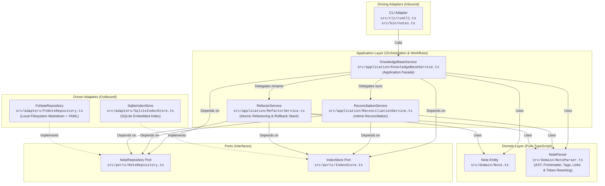

# Personal Knowledge Base

[](https://nodejs.org)
[](https://www.typescriptlang.org)
[](https://vitest.dev)
[](#architecture--design)
[](https://opensource.org/licenses/MIT)

A local-first personal knowledge management system for organizing interconnected notes, ideas, and concepts. It pairs plain Markdown file storage in a local Vault with an embedded SQLite metadata index to deliver fast graph queries, atomic wiki-link refactoring with compensating rollback, ghost note detection, and eventual consistency reconciliation.

For domain terminology, ubiquitous language, and naming rules, see [CONTEXT.md](CONTEXT.md).

---

## Features

- **Local-First & Future-Proof**: Notes are authored and stored as standard Markdown files with YAML frontmatter on your local filesystem (the Vault).
- **Interconnected Wiki-Links**: Connect concepts naturally using `[[Note Title]]` syntax, with support for pipe display aliases (`[[Target|Custom Label]]`) and section/heading anchors (`[[Target#Heading]]`, `[[Target#Heading|Alias]]`).
- **Bi-directional Backlinks**: Discover incoming references pointing to any note across your knowledge base.
- **Ghost Note Detection**: Uncover referenced ideas and stubs that have been linked to via wiki-links but not yet authored in the Vault.
- **Atomic Note Refactoring**: Safely rename a note and automatically rewrite incoming wiki-links (and self-referential links) across all referencing notes in the Vault.
- **Compensating Rollback**: Protected by an encapsulated LIFO rollback stack in `RefactorService`—any disk I/O error or SQLite failure during refactoring automatically unrolls prior mutations to maintain strict consistency without filesystem locks.
- **Fast SQLite Metadata Index**: Cached query layer for tag searches, backlinks, and graph relationships without locking your data into a proprietary database format.
- **Two-Way Reconciliation**: Automatically syncs external filesystem modifications (`mtime`) on startup or on demand via `notes sync`.

---

## Quickstart

### Prerequisites

- [Node.js](https://nodejs.org) (v18 or later)
- `npm`

### Installation & Build

Clone the repository and install dependencies:

```bash
git clone <repository-url>
cd note-taking-app
npm install
npm run build
```

### Running the CLI

You can link the package globally to use the `notes` command anywhere:

```bash
npm link
notes --help
```

Alternatively, invoke the local build script:

```bash
npm run notes -- --help
```

### Configuration

The CLI operates against a local Vault directory and an embedded SQLite index cache. You can configure locations via environment variables:

| Variable | Description | Default |
| :--- | :--- | :--- |
| `NOTES_VAULT` | Absolute or relative path to the Vault directory holding Markdown notes. | `./vault` (inside current working directory) |
| `NOTES_DB` | Path to the SQLite metadata index file. | `$NOTES_VAULT/.notes-index.sqlite` |

---

## CLI Command Reference

| Command | Arguments / Flags | Description |
| :--- | :--- | :--- |
| `notes create` | `<title> [--body "<text>"] [--tags "<tag1,tag2>"]` | Create a new note with optional body and comma-separated tags. |
| `notes view` | `<title>` | Display note frontmatter, body content, and incoming backlinks. |
| `notes search` | `--tag <tag>` | Find and list all notes matching a specific tag. |
| `notes backlinks`| `<title>` | List all notes that contain wiki-links pointing to the specified note. |
| `notes ghost-notes` | *(none)* | List all referenced `[[Wiki-links]]` that have not yet been authored as notes in the Vault. |
| `notes rename` | `<old-title> <new-title>` | Atomically rename note and refactor incoming wiki-links across all referencing notes. |
| `notes sync` | *(none)* | Reconcile Vault modifications on disk (`mtime`) with the SQLite metadata index. |
| `notes --help` | `[-h]` | Show help text and command list. |

> **Note**: The CLI automatically executes fast reconciliation (`mtime` check) on startup before running query and refactoring commands (`view`, `search`, `backlinks`, `ghost-notes`, `rename`) to guarantee up-to-date results.

---

## Step-by-Step Walkthrough

The following walkthrough demonstrates building and maintaining a knowledge base of software architecture concepts.

### 1. Create a note linking to an unwritten concept

Create an introductory note that references another note using `[[Wiki-link]]` syntax:

```bash
notes create "Architecture Overview" \
  --tags "architecture,guide" \
  --body "A high-level overview of system design. We adhere to [[Clean Architecture]] principles."
```

### 2. Discover Ghost Notes

Because `Clean Architecture` has not been authored yet, it is tracked as a Ghost Note:

```bash
notes ghost-notes
```

**Output:**
```
Ghost notes:
  • Clean Architecture (referenced by: Architecture Overview)
```

### 3. Author the missing note

Create the `Clean Architecture` note to materialize the concept:

```bash
notes create "Clean Architecture" \
  --tags "architecture,patterns" \
  --body "Domain-centric architecture where business rules are isolated from frameworks."
```

Checking ghost notes now reports that all links are resolved:

```bash
notes ghost-notes
# Output: No ghost notes found.
```

### 4. Inspect Backlinks

View `Clean Architecture` to see its metadata, content, and the incoming backlink from `Architecture Overview`:

```bash
notes view "Clean Architecture"
```

**Output:**
```
========================================
Title: Clean Architecture
Tags:  architecture, patterns
========================================

Domain-centric architecture where business rules are isolated from frameworks.

========================================
Backlinks:
  • Architecture Overview
========================================
```

### 5. Automated Wiki-Link Refactoring on Rename

Rename `Clean Architecture` to `Hexagonal Architecture`:

```bash
notes rename "Clean Architecture" "Hexagonal Architecture"
```

**Output:**
```
Renamed note "Clean Architecture" to "Hexagonal Architecture".
Modified notes:
  • Hexagonal Architecture.md
  • Architecture Overview.md
Updated 1 referencing note(s):
  • Architecture Overview
```

The CLI renames `vault/Clean Architecture.md` to `vault/Hexagonal Architecture.md` and rewrites `[[Clean Architecture]]` to `[[Hexagonal Architecture]]` inside `vault/Architecture Overview.md`. If an unexpected disk or database error occurs during the operation, `RefactorService` unrolls all writes automatically.

### 6. External Edits & Reconciliation

If you edit notes directly using an external editor (such as VS Code or Obsidian) or add/remove files on disk, reconcile the index:

```bash
notes sync
```

**Output:**
```
Reconciliation complete:
  • Added: 1 note(s) (Event Driven Architecture)
  • Updated: 0 note(s)
  • Removed: 0 note(s)
```

---

## Architecture & Design

The application is structured using **Hexagonal Architecture** (Ports and Adapters). The business logic and domain model are completely decoupled from filesystem I/O, SQLite database drivers, and command-line interfaces.

### Architecture Diagram



### Directory Structure

```
src/
├── domain/            # Pure domain models, parsers, and business logic
│   ├── Note.ts                 # Note entity interface and frontmatter types
│   ├── NoteParser.ts           # Markdown parsing, frontmatter, tags, and link rewriting
│   └── index.ts                # Domain barrel export
├── ports/             # Secondary / Driven port contracts
│   ├── NoteRepository.ts       # Note persistence interface (get, save, delete, exists, list)
│   ├── IndexStore.ts           # Metadata index query and mutation interface
│   └── index.ts                # Ports barrel export
├── application/       # Application use-case orchestrators and transaction services
│   ├── KnowledgeBaseService.ts # Main application facade
│   ├── ReconciliationService.ts# mtime-based index synchronization
│   ├── RefactorService.ts      # Multi-note atomic refactoring with compensating rollback
│   └── index.ts                # Application barrel export
├── adapters/          # Secondary / Driven concrete infrastructure implementations
│   ├── FsNoteRepository.ts     # Local filesystem Markdown storage adapter
│   ├── SqliteIndexStore.ts     # SQLite metadata index adapter
│   └── index.ts                # Adapters barrel export
├── cli/               # Primary / Driving CLI adapter
│   ├── runCli.ts               # Command routing, argument parsing, and console I/O
│   └── index.ts                # CLI barrel export
└── bin/               # Executable binary entry point
    └── notes.ts                # Environment configuration, DI wiring, and runner
```

### Architecture Decision Records (ADRs)

Key design decisions and architectural trade-offs are documented under [`docs/adr/`](docs/adr/):

| ADR | Title | Key Architectural Rationale & Trade-off |
| :--- | :--- | :--- |
| [0001](docs/adr/0001-local-markdown-storage.md) | **Local Markdown Storage** | Plain Markdown files with YAML frontmatter ensure user data ownership, transparency, and portability over proprietary databases. |
| [0002](docs/adr/0002-sqlite-metadata-index.md) | **SQLite Metadata Index** | Embedded SQLite cache accelerates relational queries (tags, backlinks, ghost notes) while keeping Markdown files the primary source of truth. |
| [0003](docs/adr/0003-domain-library-cli-adapter.md) | **Domain Library & CLI Adapter** | Separating core knowledge base services from CLI execution allows future integration with GUI, web, or daemon frontends. |
| [0004](docs/adr/0004-hexagonal-architecture.md) | **Hexagonal Architecture** | Enforces clean dependency boundaries via ports and adapters, ensuring core business logic remains independent of storage and I/O. |
| [0005](docs/adr/0005-eventual-consistency-reconciliation.md) | **Eventual Consistency Reconciliation** | Lightweight file modification checks (`mtime`) enable efficient cache re-indexing without requiring background filesystem daemons. |
| [0006](docs/adr/0006-atomic-note-refactoring.md) | **Atomic Note Refactoring with Compensating Rollback** | Encapsulates the multi-note refactoring workflow in a dedicated application `RefactorService` with a LIFO rollback stack to maintain vault/index consistency without filesystem locks. |

---

## Development & Testing

### Running Tests

The test suite is built with [Vitest](https://vitest.dev) and covers domain parsing, refactoring algorithms, rollback mechanics, service orchestration, and adapter implementations:

```bash
# Run all unit and integration tests once
npm test

# Run tests in watch mode during development
npm run test:watch
```

### Testing Strategy

The test suite contains **105 automated tests** across all architectural layers:

- **Domain Tests** (`src/domain/*.test.ts`): Fast, zero-dependency unit tests verifying frontmatter parsing, tag extraction, wiki-link detection, and regex token replacement (including pipe aliases and section heading anchors).
- **Application Tests** (`src/application/*.test.ts`):
  - `KnowledgeBaseService.test.ts`: Facade orchestration tests across note CRUD, tag searching, ghost note resolution, and graph topologies.
  - `ReconciliationService.test.ts`: Tests `mtime`-based detection of added, modified, and deleted external files.
  - `RefactorService.test.ts`: Exhaustive tests for atomic note refactoring, compensating rollback execution order, simulated disk/database errors, unindexed note cleanup, and heading anchor backlinks.
- **Adapter Tests** (`src/adapters/*.test.ts`): Integration tests asserting concrete filesystem operations in temporary directories and live SQLite database queries.
- **CLI Tests** (`src/cli/*.test.ts`): Command-line parsing, flag extraction, and stdout/stderr formatting tests using injected mock I/O streams.

---

## License

This project is open source and available under the [MIT License](LICENSE).
